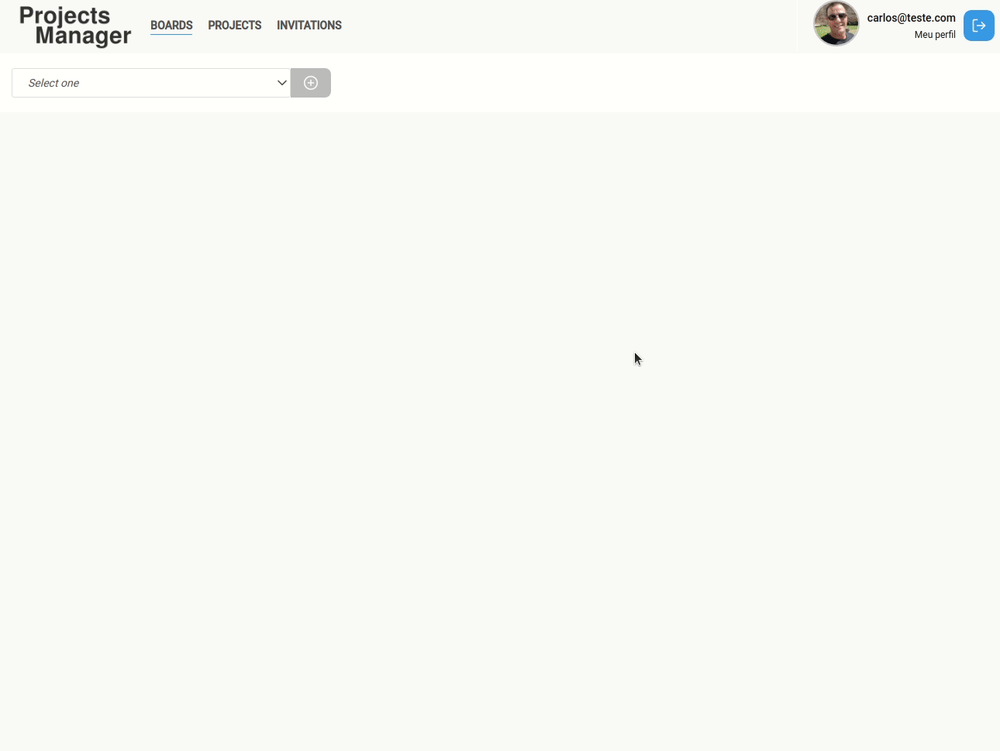

<h1 align="center">
  
</h1>

<h3 align="center">
  Projects Manager
</h3>

# Frontend em ReactJS para uma aplicação de EXEMPLO/ESTUDO [RealLive](https://pm.mourabraz.com)

## Aplicação:

1. Utiliza a API do ProjectManager (feita em NestJs)

2. As páginas são:

- SigIn/SignUp: para autenticação/criação de usuário;
- Home: páginal inicial (que nesta versão de demonstração possui algumas informações);
- Boards: trata-se do quadro propriamente dito, onde é gerenciado os projetos e as tarefas de cada projeto;
- Projects: _not implemented_ - seria a página de listagem de todos os projectos, incluindo os arquivados e os partilhados;
- Invitatios: página com a lista de convites de participação realizados e recebidos;
- Profile: página de atualização do usuário;
- Forgot Password: _not implemented_

<div align="center" style="padding: 16px; background-color: #222;">
  
  
  
  
  
  
  
  
</div>

## O projecto não está concluído e foi feito por motivos de estudo e de apresentação!

# Instalação e Inicialização

```
git clone https://github.com/mourabraz/projectmanager-frontend.git
```

e

```
cd /projectmanager-frontend
npm install
```

ou

```
cd /projectmanager-frontend
yarn
```

e

```
npm start
```

ou

```
yarn start
```

Acesse pelo Navegador:

[http://localhost:3000/](http://localhost:3000/)

## Exemplos:

<div align="center" style="padding: 16px; border: 1px solid #222; border-radius: 8px;">
  
  
  
  
</div>

## Agradecimentos

Aos desenvolvedores e mantenedores das seguintes bibliotecas:

- [axios](https://github.com/axios/axios)
- [date-fns](https://date-fns.org/)
- [date-fns-tz](https://github.com/marnusw/date-fns-tz#readme)
- [draft-convert](https://github.com/HubSpot/draft-convert#readme)
- [draft-js](https://draftjs.org/)
- [immer](https://github.com/immerjs/immer)
- [polished](https://github.com/styled-components/polished)
- [react](https://reactjs.org/)
- [react-beautiful-dnd](https://github.com/atlassian/react-beautiful-dnd)
- [react-datepicker](https://reactdatepicker.com/)
- [react-dom](https://reactjs.org/docs/react-dom.html)
- [react-icons](https://react-icons.github.io/react-icons/)
- [react-router-dom](https://github.com/ReactTraining/react-router#readme)
- [react-scripts](https://github.com/facebook/create-react-app#readme)
- [react-spring](https://www.react-spring.io/)
- [react-toastif](https://github.com/fkhadra/react-toastify)
- [react-transition-group](https://reactcommunity.org/react-transition-group/)
- [styled-components](https://styled-components.com/)
- [typescript](https://www.typescriptlang.org/)
- [uuidv4](https://github.com/thenativeweb/uuidv4#readme)
- [yup](https://github.com/jquense/yup)

## License

MIT © mourabraz@hotmail.com
